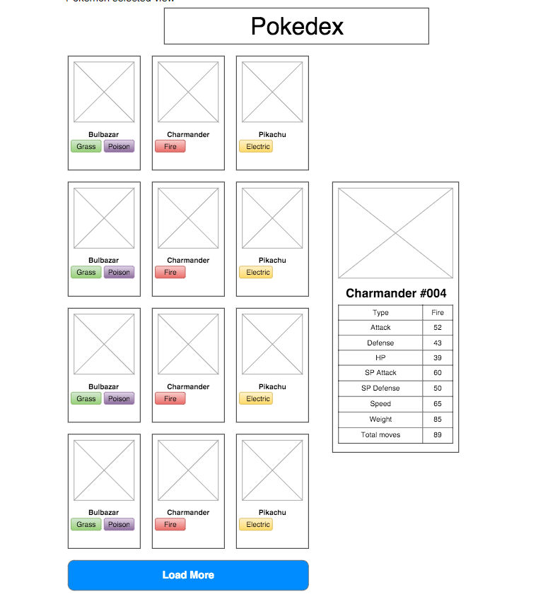

## Pokedex App

[Live demo](https://glem1337.github.io/pokedex/)

## Использовал инструменты
- node version 12.16.3
- React;
- create-react-app;
- material-ui;
- react-redux;
- redux;
- redux-thunk;
- axios;
- react-sticky-box;
- node-sass;

## Задание

Getting ready to Pokemon GO launch, it became obviously we need a source of info about pokemons. In order to do this, we need to create a client for http://pokeapi.co/
Our designer thinks it should look as following:

On click of ‘Load More’ another chunk of the list is being loaded and displayed on the page. Pokemon details should be displayed after clicking on the single pokemon in list. Previously shown pokemon details should disappear. 

Regarding API:
1. Get chunk of pokemon list http://pokeapi.co/api/v1/pokemon/?limit=12
2. Get information about single pokemon http://pokeapi.co/api/v1/pokemon/{{id}}
3. Image of pokemon http://pokeapi.co/media/img/{{id}}.png  (or available through sprites.resource_uri resource)
4. All possible types http://pokeapi.co/api/v1/type/?limit=999

You can find out more information from the docs

Bonus points for implementing (not all done yet):
1. ~~Adaptive styling (able to view this on all screen widths)~~
2. Filter visible pokemons by type

For this task you can use any css/js library/framework.

Handing in task:
Source code of the task should be available through the GitHub. There should be README.md (markdown file) file with clear instructions on how to run client app. It is preferable to have standalone running app using github-pages (just push your code to gh-pages branch of the repo).

## Available Scripts

In the project directory, you can run:

### `npm start`

Runs the app in the development mode. 
Open [http://localhost:3000](http://localhost:3000) to view it in the browser.

The page will reload if you make edits. 
You will also see any lint errors in the console.

### `npm test`

Launches the test runner in the interactive watch mode. 
See the section about [running tests](https://facebook.github.io/create-react-app/docs/running-tests) for more information.

### `npm run build`

Builds the app for production to the `build` folder. 
It correctly bundles React in production mode and optimizes the build for the best performance.

The build is minified and the filenames include the hashes. 
Your app is ready to be deployed!

See the section about [deployment](https://facebook.github.io/create-react-app/docs/deployment) for more information.

### `npm run eject`

**Note: this is a one-way operation. Once you `eject`, you can’t go back!**

If you aren’t satisfied with the build tool and configuration choices, you can `eject` at any time. This command will remove the single build dependency from your project.

Instead, it will copy all the configuration files and the transitive dependencies (webpack, Babel, ESLint, etc) right into your project so you have full control over them. All of the commands except `eject` will still work, but they will point to the copied scripts so you can tweak them. At this point you’re on your own.

You don’t have to ever use `eject`. The curated feature set is suitable for small and middle deployments, and you shouldn’t feel obligated to use this feature. However we understand that this tool wouldn’t be useful if you couldn’t customize it when you are ready for it.

### `npm run build` fails to minify

This section has moved here: https://facebook.github.io/create-react-app/docs/troubleshooting#npm-run-build-fails-to-minify
